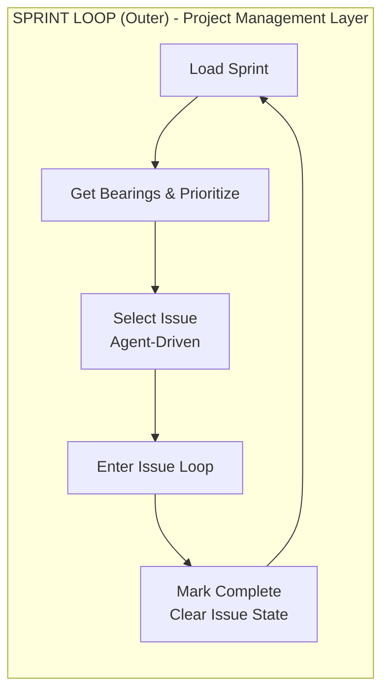
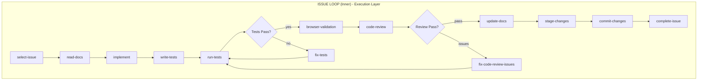

# ClaudeSprint v2

> [!CAUTION]
> **Alpha Software** - This project is in early development. APIs, configuration formats, and behavior may change without notice. Use in production environments at your own risk. Please report issues and feedback on [GitHub Issues](https://github.com/arc-co/claudesprint/issues).

A dual-loop agentic workflow for autonomous software development, aligned with Anthropic's ["Effective harnesses for long-running agents"](https://www.anthropic.com/engineering/effective-harnesses-for-long-running-agents) research.

ClaudeSprint orchestrates Claude Code sessions to build complete features autonomously - from specification to tested, committed code - while maintaining context across sessions through structured JSON artifacts.

## Why ClaudeSprint?

Traditional AI coding assistants lose context between sessions. ClaudeSprint solves this with:

- **Fresh sessions per step** - Each workflow step gets a clean context, preventing hallucination accumulation
- **Structured handoffs** - JSON artifacts (`sprint.json`, `current_issue.json`) pass verified state between sessions
- **Agent-driven decisions** - The AI selects issues based on dependencies, risk, and context continuity
- **Validation gates** - Schema validation, tests, and code review before any commit
- **Recovery built-in** - Automatic backup/restore handles crashes and failures

## Architecture

ClaudeSprint uses a two-loop architecture:





### Sprint Loop (Outer)
Manages the overall sprint until all issues are complete:
1. Loads `sprint.json` - the source of truth for all issues
2. Runs "Get Bearings" - summarizes status, optionally re-prioritizes
3. Agent selects the next issue based on dependencies, impact, and context
4. Creates `current_issue.json` to track active work
5. Enters the Issue Loop
6. On completion: marks issue done, clears state, repeats

### Issue Loop (Inner)
Executes a single issue through a structured workflow:
- **read-docs**: Gather relevant documentation
- **implement**: Make minimal, focused code changes
- **write-tests**: Add tests for acceptance criteria
- **run-tests**: Execute the test suite
- **fix-tests**: Debug failures (distinguishes code bugs from test bugs)
- **browser-validation**: E2E validation for UI features
- **code-review**: Automated review against the spec
- **commit**: Stage and commit only after all gates pass

## Prerequisites

### Platform Support

- **macOS & Linux:** Fully supported.
- **Windows:** **NOT supported natively.** You must use [WSL2 (Windows Subsystem for Linux)](https://learn.microsoft.com/en-us/windows/wsl/install) to run this project.

### Required Dependencies

| Dependency | Version | Installation | Verify |
|------------|---------|--------------|--------|
| **Python** | 3.10+ | [python.org](https://www.python.org/downloads/) | `python3 --version` |
| **Claude Code CLI** | Latest | [Installation Guide](https://docs.anthropic.com/en/docs/claude-code) | `claude --version` |

> **Critical:** Claude Code CLI must be installed and authenticated. Run `claude login` after installation.

### Optional Dependencies

| Tool | Purpose | Installation |
|------|---------|--------------|
| `agent-browser` | Browser automation for E2E UI testing | `npm install -g agent-browser && agent-browser install` |
| `jq` | JSON parsing in shell (helpful for debugging) | `brew install jq` or `apt install jq` |

## Installation

### Using pip (Recommended)

```bash
# Install from PyPI
pip install claudesprint

# Verify installation
claudesprint --version
```

### Using pipx (Isolated Environment)

```bash
# Install pipx if needed
pip install pipx
pipx ensurepath

# Install ClaudeSprint
pipx install claudesprint
```

### From Source

```bash
git clone https://github.com/arc-co/claudesprint.git
cd claudesprint
pip install -e ".[dev]"
```

### Verify Installation

Run the doctor command to verify all dependencies:

```bash
claudesprint doctor
```

Use `--fix` to auto-install missing packages:

```bash
claudesprint doctor --fix
```

## Cost Awareness & Limits

ClaudeSprint runs autonomous loops that consume API tokens. By default, critical steps (Implementation, Code Review, Fix Tests) use **Claude Opus**, while others use Sonnet.

**To control costs:**

1. **Set Iteration Limits:** Always start with `claudesprint run -n 5` to verify behavior before running unlimited.
2. **Override Models:** Use `CLAUDESPRINT_MODEL_OVERRIDE=sonnet` to force cheaper models for all steps.
3. **Monitor Usage:** Check your Anthropic Console dashboard regularly.

## Quick Start

### 1. Initialize a Project

```bash
cd your-project
claudesprint initrepo
```

### 2. Create a Spec

Create a specification file in `.claudesprint/specs/`:

```bash
mkdir -p .claudesprint/specs
# Create your spec file (see docs for format)
```

### 3. Initialize and Run

```bash
claudesprint init --spec SPEC_01.md
claudesprint run
```

For detailed instructions, see the [Quickstart Guide](docs/getting-started/quickstart.md).

## Demo: URL Shortener

Try the built-in demo to see ClaudeSprint in action:

**Tech Stack:**
- TypeScript + Express + Handlebars
- JSON file database
- HTMX for interactivity
- Vitest for testing

**Features:**
- Shorten long URLs to short codes
- Redirect short URLs to original destinations
- Persist URLs across server restarts
- Clean HTMX-powered UI

To build this demo:

```bash
# Create and run the demo project
claudesprint demo

# Or manually:
claudesprint init --spec path/to/demo.md
claudesprint run
```

Watch as ClaudeSprint autonomously builds the complete application, issue by issue.

## CLI Reference

```bash
claudesprint doctor              # Diagnose environment
claudesprint initrepo            # Initialize project
claudesprint status              # Check workflow state
claudesprint init --spec FILE    # Create sprint from specification
claudesprint run                 # Execute the workflow
claudesprint run -n 10           # Limit to 10 iterations
claudesprint sprints             # List available sprints
claudesprint reset               # Clear current issue state
claudesprint plan --spec FILE    # Update sprint from modified spec
claudesprint validate            # Validate JSON artifacts
claudesprint models              # Show model configuration
claudesprint notify TYPE MSG     # Send manual notification
```

## Project Structure

```
.claude/                      # Claude Code configuration
├── CLAUDE.md                 # Project instructions for Claude
├── skills/                   # Custom skills
└── settings.json             # Claude settings

.claudesprint/                # ClaudeSprint system (user-owned)
├── config/                   # Configuration
│   ├── project.json          # Dev server, URLs
│   ├── hooks.json            # Test/build commands
│   ├── models.json           # Per-step model selection
│   └── notifications.json
├── prompts/                  # Prompt overrides (optional)
├── specs/                    # Specification files
│   └── examples/             # Example specs
├── sprints/                  # Generated sprints
│   └── SPEC_01/
│       └── sprint.json
├── project/                  # Runtime state
│   ├── current_issue.json
│   └── current_issue.log
└── state/                    # Session state
    └── sprint.lock

claudesprint/                 # Python package (installed)
├── prompts/                  # Default workflow prompts
└── schemas/                  # JSON validation schemas
```

## Configuration

### Model Selection

ClaudeSprint optimizes costs by using different models for different steps:

| Step | Default Model | Rationale |
|------|---------------|-----------|
| `implement` | Opus | Core code generation |
| `fix-tests` | Opus | Nuanced judgment |
| `code-review` | Opus | Critical quality gate |
| `select-issue` | Sonnet | Algorithmic selection |
| `write-tests` | Sonnet | Pattern-based |
| Others | Sonnet | Lower-stakes steps |

Override via config or environment:
```bash
CLAUDESPRINT_MODEL_OVERRIDE=opus claudesprint run
```

### Hooks

Configure test commands in `.claudesprint/config/hooks.json`:

```json
{
  "validate": {
    "command": "npm run validate",
    "timeout": 600
  },
  "test": {
    "command": "npm test",
    "timeout": 300
  }
}
```

### Notifications

Get notified of progress via Bark (iOS) in `.claudesprint/config/notifications.json`:

```json
{
  "enabled": true,
  "bark": {
    "enabled": true,
    "url": "https://api.day.app/YOUR_KEY"
  }
}
```

## Writing Specifications

Specifications define what ClaudeSprint will build. Place them in `.claudesprint/specs/`:

```markdown
# SPEC 01 - Feature Name

## Purpose
What this spec delivers.

## Constraints
- Technical constraints
- What NOT to do

## Deliverables
- Specific outcomes

## Work Plan
### 1) First milestone
- Task details
- Acceptance criteria

### 2) Second milestone
...

## Acceptance Checklist
- [ ] Criterion 1
- [ ] Criterion 2
```

The `claudesprint init` command parses specifications and generates structured sprints with individual issues, dependencies, and acceptance criteria.

> [!WARNING]
> **ClaudeSprint uses Claude Code hooks that may interfere with normal Claude Code usage.**
>
> The `.claude/settings.json` file contains hooks (`PreToolUse`, `Stop`) that enable ClaudeSprint's autonomous workflow. These hooks:
> - **server-guard** - Blocks watch commands and interactive git that would hang the agent
> - **browser-guard** - Coordinates browser automation for the Skill tool
> - **autonomous-continue** - Enables autonomous loop continuation on Stop events
>
> The hooks call `claudesprint hook --type <hook-type>` and only activate when a ClaudeSprint session is running (detected via `.claudesprint/state/session.lock`).
>
> **If you plan to use Claude Code manually** (outside of ClaudeSprint), you can safely do so - the hooks auto-disable when no session is active.

## Troubleshooting

### "current_issue.json validation failed"
```bash
claudesprint validate  # See which fields are missing
claudesprint reset     # Start fresh
```

### Stuck in a loop
Check `current_issue.json` for `current_failures` - there may be unresolved issues blocking progress.

### Max retry limit reached
```bash
# Review failures
cat .claudesprint/project/current_issue.json | jq '.current_failures'

# Override limit if needed
CLAUDESPRINT_MAX_RETRY=10 claudesprint run
```

### Browser validation failing
```bash
# Reinstall browser dependencies
agent-browser install --with-deps  # Linux
agent-browser install              # macOS
```

### "Command not found: claude"
The Claude Code CLI is missing from your PATH. Install it following the [official guide](https://docs.anthropic.com/en/docs/claude-code) and verify by running `claude --version`.

### "npm: command not found" or Agent-Browser errors
Ensure Node.js is installed. If using the default setup, `agent-browser` is installed via npm. Verify with `node --version` and `npm --version`.

## Data & Privacy

ClaudeSprint runs locally on your machine.

- Your code is sent to Anthropic's API via the Claude CLI for processing.
- No third-party servers (other than Anthropic) receive your code.
- State files (`current_issue.json`, `sprint.json`) are stored locally in `.claude/`.

## Contributing

See [CONTRIBUTING.md](CONTRIBUTING.md) for detailed guidelines on:

- Contributing to the core engine (`.claudesprint/`)
- Contributing example specifications
- Governance: treating claudesprint as vendored code vs. modifying it

**Quick start for contributors:**
1. Fork the repository
2. Create a feature branch
3. Make your changes and test them
4. Submit a pull request

## License

This project is licensed under the MIT License - see the [LICENSE](LICENSE) file for details.

## Acknowledgments

Built on insights from Anthropic's research on effective agent harnesses and the Claude Code development experience.
