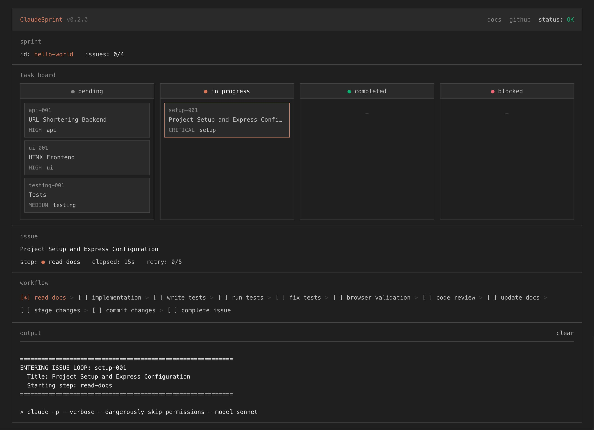
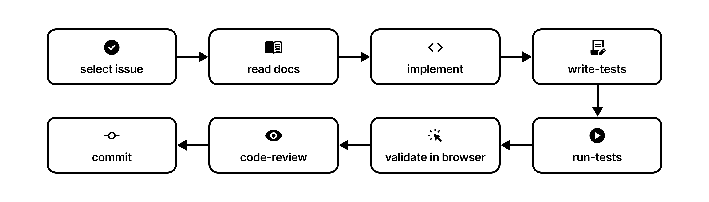
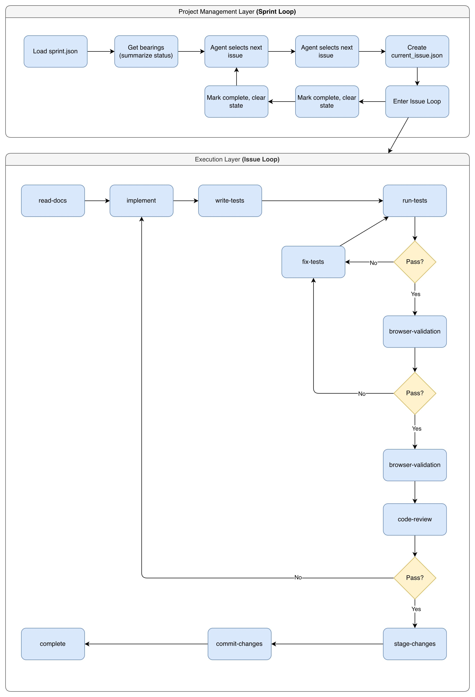

<p align="center">
  
</p>

<p align="center">
  <strong>Autonomous AI-driven software development.</strong><br/><br/>
  ClaudeSprint orchestrates Claude Code to build complete features end-to-end.
</p>

<p align="center">
  
</p>

[](https://pypi.org/project/claudesprint/)
[](https://www.python.org/downloads/)
[](https://opensource.org/licenses/MIT)

**[PyPI](https://pypi.org/project/claudesprint/)** | **[Documentation](https://arc-co.github.io/claudesprint/)** | **[GitHub](https://github.com/arc-co/claudesprint)**

> **Alpha Software** - APIs and behavior may change. [Report issues](https://github.com/arc-co/claudesprint/issues)

## Why ClaudeSprint?

Inspired by Agile sprints and Extreme Programming practices (test-first, continuous integration, small iterations), ClaudeSprint brings disciplined software development to AI agents.

AI coding assistants lose context between sessions. ClaudeSprint solves this with:

- **Fresh sessions per step** - Clean context prevents hallucination accumulation
- **Structured handoffs** - JSON artifacts pass verified state between sessions
- **Validation gates** - Tests and code review before any commit
- **Recovery built-in** - Automatic backup/restore handles failures

## Quick Start

### 1. Install

```bash
pip install claudesprint
```

Or install with [pipx](https://pipx.pypa.io/) for isolated environment:

```bash
pipx install claudesprint
```

**Requirements:** Python 3.10+ and [Claude Code CLI](https://docs.anthropic.com/en/docs/claude-code) (authenticated)

### 2. Verify Setup

```bash
claudesprint doctor
```

### 3. Try the Demo

```bash
claudesprint demo
```

Watch ClaudeSprint build a complete URL shortener app autonomously.

### 4. Start Your Own Project

```bash
claudesprint quickstart
```

## How It Works

<p align="center">
  
</p>

Each step runs in a fresh Claude session with focused context. State is passed via JSON artifacts, not conversation history.

<details>
<summary><strong>View detailed architecture</strong></summary>
<br/>
<p align="center">
  
</p>
</details>

[Full architecture documentation →](https://arc-co.github.io/claudesprint/concepts/architecture/)

## Commands

```bash
claudesprint quickstart      # Interactive project setup
claudesprint demo            # Try with sample project
claudesprint doctor          # Check environment
claudesprint run             # Execute workflow
claudesprint run -n 5        # Limit iterations
claudesprint status          # View current state
claudesprint reset           # Clear issue state
```

[Full CLI reference →](https://arc-co.github.io/claudesprint/reference/cli-commands/)

## Cost Awareness

ClaudeSprint runs autonomous loops that consume API tokens. Control costs with:

```bash
# Limit iterations (recommended for testing)
claudesprint run -n 5

# Use cheaper models for all steps
CLAUDESPRINT_MODEL_OVERRIDE=sonnet claudesprint run
```

[Cost management guide →](https://arc-co.github.io/claudesprint/guides/cost-management/)

## Documentation

- [Installation](https://arc-co.github.io/claudesprint/getting-started/installation/)
- [Quickstart Guide](https://arc-co.github.io/claudesprint/getting-started/quickstart/)
- [Writing Specifications](https://arc-co.github.io/claudesprint/guides/specifications/)
- [Configuration](https://arc-co.github.io/claudesprint/guides/configuration/)
- [Troubleshooting](https://arc-co.github.io/claudesprint/reference/troubleshooting/)

## Contributing

See [CONTRIBUTING.md](CONTRIBUTING.md) for guidelines.

## License

MIT - see [LICENSE](LICENSE)
