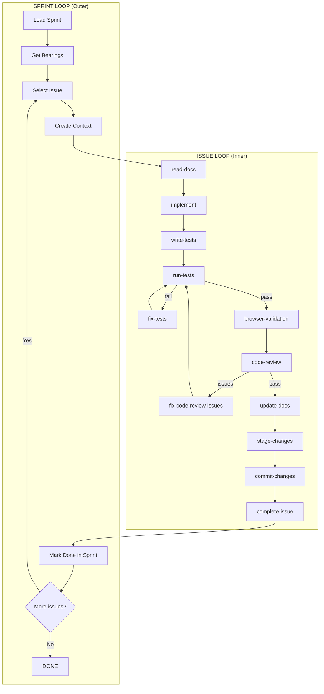
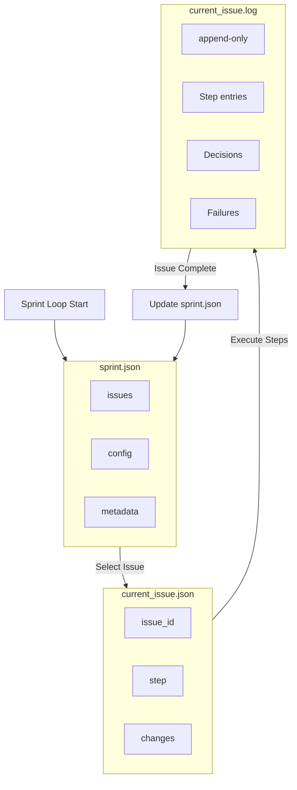

# Architecture

ClaudeSprint's architecture is designed around one core insight: **long-running AI agents accumulate errors**. Context windows fill up, hallucinations compound, and the agent drifts from its original intent. The solution is structured, bounded sessions with explicit state handoffs.

## The Dual-Loop System

## Sprint Loop (Outer Loop)

The Sprint Loop manages the project-level workflow. It runs continuously until all issues are complete.

### Responsibilities

1. **Load Sprint State**: Read `sprint.json` to understand pending, in-progress, and completed issues
2. **Get Bearings**: Summarize current sprint status, identify blockers, check dependencies
3. **Select Issue**: Agent-driven selection based on:
   - Dependencies (can't start blocked issues)
   - Priority (critical before high before medium)
   - Context continuity (related issues together)
   - Risk reduction (infrastructure before features)
4. **Create Issue Context**: Initialize `current_issue.json` with all context needed for the Issue Loop
5. **Monitor Completion**: When Issue Loop completes, update sprint status and repeat

### Key Design Decisions

**Fresh Sessions**: Each iteration starts a fresh Claude session. This prevents context accumulation but requires explicit state management.

**Agent-Driven Selection**: The agent decides which issue to work on next, not a linear queue. This allows intelligent prioritization based on the current state of the codebase.

**Stateless Between Iterations**: The only state passed between sprint loop iterations is `sprint.json`. All context must be explicitly recorded.

## Issue Loop (Inner Loop)

The Issue Loop executes a single issue from start to completion. It's the workhorse of ClaudeSprint.

### Step Sequence

| Step | Purpose | Next Step |
|------|---------|-----------|
| `select-issue` | Pick next issue from sprint | `read-docs` |
| `read-docs` | Gather documentation and context | `implement` |
| `implement` | Write code changes | `write-tests` |
| `write-tests` | Create/update tests | `run-tests` |
| `run-tests` | Execute test suite | `fix-tests` or `browser-validation` |
| `fix-tests` | Fix test failures | `run-tests` |
| `browser-validation` | E2E browser testing (UI issues) | `code-review` |
| `code-review` | Review against spec | `fix-code-review-issues` or `update-docs` |
| `fix-code-review-issues` | Address review findings | `run-tests` |
| `update-docs` | Update documentation | `stage-changes` |
| `stage-changes` | Git stage changes | `commit-changes` |
| `commit-changes` | Create commit | `complete-issue` |
| `complete-issue` | Mark issue done in sprint | Return to Sprint Loop |

### Step Details

#### `select-issue`
Chooses the next issue to work on. Considers:
- Dependency graph (blocked issues can't be selected)
- Priority ordering
- Category grouping (batch similar work)
- Recent context (prefer related issues)

#### `read-docs`
Gathers information for implementation:
- Reads project documentation in `/docs`
- Uses Context7 for library documentation (if configured)
- Explores existing codebase patterns
- Identifies relevant files to modify

#### `implement`
Makes code changes:
- Minimal changes to satisfy acceptance criteria
- Follows existing patterns
- No scope creep ("while I'm here" changes)

#### `write-tests`
Creates or updates tests:
- Tests map to acceptance criteria
- Uses project's test framework
- Includes edge cases from the spec

#### `run-tests`
Executes the test suite:
- Runs command from `hooks.json`
- Captures output for failure analysis
- Routes to `fix-tests` on failure

#### `fix-tests`
Analyzes and fixes test failures:
- Determines if failure is code bug or test bug
- If code bug: routes back to `implement`
- If test bug: fixes the test
- Must verify expectations against spec before fixing

#### `browser-validation`
E2E browser testing using `agent-browser`:
- Only runs for UI-related issues
- Validates visual acceptance criteria
- Captures screenshots as evidence
- Routes to `implement` on failure

#### `code-review`
Reviews changes against specification:
- Checks all acceptance criteria are met
- Verifies no unintended changes
- Confirms code quality standards
- Routes to `fix-code-review-issues` if problems found

#### `fix-code-review-issues`
Addresses code review findings:
- Makes targeted fixes
- Reruns tests after changes
- Returns to code review for verification

#### `update-docs`
Updates project documentation:
- Only if warranted by the change
- Skips for bugfixes, refactors, test-only changes
- Updates API docs, feature docs as needed

#### `stage-changes` / `commit-changes`
Git operations:
- Stages specific files (not `git add -A`)
- Creates descriptive commit message
- References issue and acceptance criteria
- Skipped if not a git repository

#### `complete-issue`
Finalizes the issue:
- Updates `sprint.json` status to `completed`
- Adds history entry
- Clears `current_issue.json`
- Returns control to Sprint Loop

## State Management

### Files

| File | Scope | Purpose |
|------|-------|---------|
| `sprint.json` | Project | All issues, statuses, configuration |
| `current_issue.json` | Session | Active issue context, current step |
| `current_issue.log` | Session | Append-only activity log |

### State Flow

## Recovery Mechanisms

### Pre-flight Checks
Before each step, the workflow validates:
- `current_issue.json` exists and is valid
- Referenced sprint file exists
- Issue ID matches sprint data
- Step is valid for current state

### Backup/Restore
Before modifying `current_issue.json`:
- Creates backup copy
- Performs modification
- On failure, restores from backup

### Retry Limits
Each step has a retry counter:
- Increments on failure
- Resets on successful step completion
- Exits workflow if max reached
- Configurable via `CLAUDESPRINT_MAX_RETRY`

### Step Idempotency
Steps are designed to be rerunnable:
- Partial completion is detected
- Previous artifacts are checked
- Work resumes from last good state

## Next Steps

- [State Management](./state-management.md): Deep dive into JSON artifacts
- [Workflow Steps](./workflow-steps.md): Detailed step documentation
- [Configuration](../guides/configuration.md): Customize the workflow
