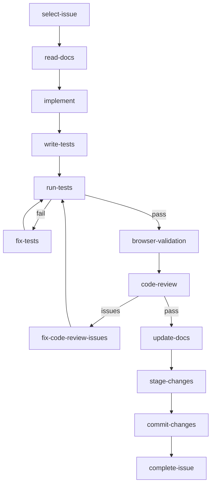
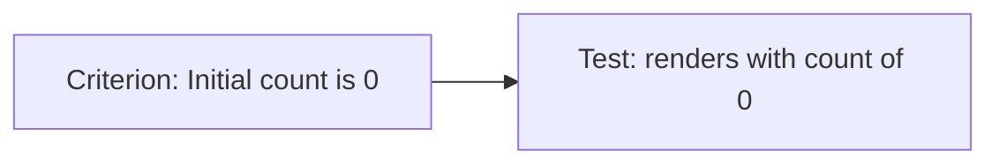
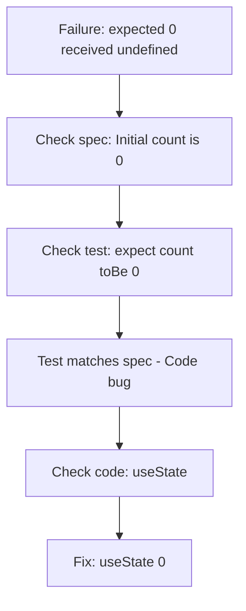

# Workflow Steps

This document details each step in the ClaudeSprint Issue Loop. Each step runs in a fresh Claude session, reads from `current_issue.json`, performs its work, and updates the state for the next step.

## Step Overview



## Step Details

### `select-issue`

**Purpose**: Choose the next issue to work on from the sprint backlog.

**Input State**:
- `sprint.json` with pending issues
- No `current_issue.json` (or previous issue cleared)

**Agent Behavior**:
1. Load `sprint.json`
2. Filter to `pending` issues with satisfied dependencies
3. Evaluate candidates based on:
   - **Priority**: critical > high > medium > low
   - **Dependencies**: Prefer issues that unblock others
   - **Category Continuity**: Batch similar work
   - **Risk**: Infrastructure before features
4. Select best candidate
5. Create `current_issue.json` with issue context

**Output State**:
```json
{
  "step": "read-docs",
  "issue_id": "feature-001",
  "goal": "Implement the counter display component",
  "context": {
    "acceptance_criteria": ["..."],
    "category": "feature"
  }
}
```

**Failure Modes**:
- No pending issues → Sprint complete
- All pending issues blocked → Report blocked state

---

### `read-docs`

**Purpose**: Gather documentation and context needed for implementation.

**Input State**:
- `current_issue.json` with `step: "read-docs"`

**Agent Behavior**:
1. Read acceptance criteria from `context`
2. Search project `/docs` for relevant documentation
3. Use Context7 (if available) for library documentation
4. Explore codebase for existing patterns
5. Identify files to modify or create
6. Document findings in `context` and session log

**Output State**:
```json
{
  "step": "implement",
  "context": {
    "external_docs_findings": "Found Button component pattern, RTL configured. Will create Counter.tsx following Button.tsx structure"
  },
  "next_action": "Create Counter component with useState hook for count state"
}
```

**Failure Modes**:
- Missing critical documentation → Proceed with best effort, log decision
- Context7 unavailable → Continue without library docs

---

### `implement`

**Purpose**: Make code changes to satisfy acceptance criteria.

**Input State**:
- `current_issue.json` with `step: "implement"`
- `context` from read-docs step

**Agent Behavior**:
1. Review acceptance criteria
2. Review context and session log for identified patterns
3. Make minimal code changes:
   - Create new files as needed
   - Modify existing files carefully
   - Follow existing code patterns
4. Record all changes made
5. Avoid scope creep

**Key Rules**:
- Only implement what acceptance criteria require
- No "while I'm here" improvements
- No refactoring unrelated code
- No speculative features

**Output State**:
```json
{
  "step": "write-tests",
  "changes": [
    {"path": "src/components/Counter.tsx", "summary": "Created Counter component"},
    {"path": "src/components/index.ts", "summary": "Added Counter export"}
  ],
  "next_action": "Write tests for Counter component acceptance criteria"
}
```

**Failure Modes**:
- Missing dependencies → Note in `current_failures`, may need different issue first
- Unclear requirements → Document assumptions in session log

---

### `write-tests`

**Purpose**: Create or update tests for the acceptance criteria.

**Input State**:
- `current_issue.json` with `step: "write-tests"`
- `changes` from implement step

**Agent Behavior**:
1. Review acceptance criteria
2. Review implementation changes
3. Create tests that verify each criterion
4. Use project's test framework and patterns
5. Include edge cases mentioned in spec

**Test Mapping**:
Each acceptance criterion should have at least one test:



**Output State**:
```json
{
  "step": "run-tests",
  "changes": [
    {"path": "src/components/Counter.tsx", "summary": "Created Counter component"},
    {"path": "src/components/Counter.test.tsx", "summary": "Added tests for acceptance criteria"}
  ]
}
```

**Failure Modes**:
- Tests already exist → Verify coverage, update if needed
- Unclear how to test → Document limitation in session log

---

### `run-tests`

**Purpose**: Execute the test suite and validate the implementation.

**Input State**:
- `current_issue.json` with `step: "run-tests"`

**Agent Behavior**:
1. Read test command from `hooks.json`
2. Execute test suite
3. Capture output
4. Analyze results:
   - All pass → Proceed to browser validation
   - Failures → Route to fix-tests

**Output State (Success)**:
```json
{
  "step": "browser-validation",
  "commands_run": ["npm run validate"],
  "current_failures": ""
}
```

**Output State (Failure)**:
```json
{
  "step": "fix-tests",
  "current_failures": "FAIL src/components/Counter.test.tsx: expected 0, received undefined",
  "retry_count": 1
}
```

---

### `fix-tests`

**Purpose**: Analyze and fix test failures.

**Input State**:
- `current_issue.json` with `step: "fix-tests"`
- `current_failures` with error details

**Agent Behavior**:
1. Parse failure message
2. **Critical**: Verify test expectations against spec first
3. Determine root cause:
   - **Code Bug**: Implementation doesn't match spec
   - **Test Bug**: Test doesn't match spec
   - **Environment Issue**: Setup/config problem
4. Fix appropriately:
   - Code bug → Route back to `implement`
   - Test bug → Fix test, route to `run-tests`

**Verification Process**:



**Output State (Test Fixed)**:
```json
{
  "step": "run-tests",
  "current_failures": ""
}
```

**Output State (Route to Implement)**:
```json
{
  "step": "implement",
  "current_failures": "Implementation missing required feature"
}
```

---

### `browser-validation`

**Purpose**: E2E browser testing for UI issues.

**Input State**:
- `current_issue.json` with `step: "browser-validation"`
- Issue `category` in context

**Agent Behavior**:
1. Check if browser validation is needed:
   - Required for: `ui`, `feature` categories (with UI components)
   - Skip for: `api`, `infrastructure`, `testing`
2. Start dev server if needed
3. Use `agent-browser` to validate:
   - Navigate to relevant pages
   - Interact with components
   - Verify visual acceptance criteria
   - Capture screenshots as evidence
4. Check for JavaScript errors

**Example Validation**:
```bash
agent-browser open http://localhost:3000
agent-browser snapshot -i
agent-browser click @counter-increment
agent-browser snapshot
agent-browser screenshot counter-after-increment.png
agent-browser errors
agent-browser close
```

**Output State (Pass)**:
```json
{
  "step": "code-review"
}
```

**Output State (Skip)**:
```json
{
  "step": "code-review"
}
```

---

### `code-review`

**Purpose**: Review implementation against specification.

**Input State**:
- `current_issue.json` with `step: "code-review"`
- `changes` listing all modified files

**Agent Behavior**:
1. Review each acceptance criterion
2. Verify implementation satisfies it
3. Check for:
   - Missing functionality
   - Incorrect behavior
   - Unintended changes
   - Code quality issues
4. Generate review findings

**Review Checklist**:
- [ ] Each acceptance criterion is implemented
- [ ] No extra functionality added
- [ ] Tests cover all criteria
- [ ] Code follows project patterns
- [ ] No security vulnerabilities
- [ ] No regressions to existing functionality

**Output State (Pass)**:
```json
{
  "step": "update-docs"
}
```

**Output State (Issues Found)**:
```json
{
  "step": "fix-code-review-issues",
  "current_failures": "Missing validation for negative count values"
}
```

---

### `fix-code-review-issues`

**Purpose**: Address issues found during code review.

**Input State**:
- `current_issue.json` with `step: "fix-code-review-issues"`
- `current_failures` with review findings

**Agent Behavior**:
1. Parse review findings
2. Make targeted fixes
3. Update only what's needed
4. Route back through tests

**Output State**:
```json
{
  "step": "run-tests",
  "changes": [..., {"path": "src/components/Counter.tsx", "summary": "Added minimum value validation"}],
  "current_failures": ""
}
```

---

### `update-docs`

**Purpose**: Update project documentation if warranted.

**Input State**:
- `current_issue.json` with `step: "update-docs"`

**Agent Behavior**:
1. Evaluate if documentation update needed:
   - New APIs → Document them
   - User-facing changes → Update feature docs
   - Configuration changes → Document options
2. If needed:
   - Update existing docs
   - Create new docs following project conventions
3. If not needed:
   - Skip to stage-changes

**Documentation Triggers**:
| Change Type | Action |
|-------------|--------|
| New API endpoint | Update `docs/api.md` |
| New UI component | Update `docs/components.md` |
| New config option | Update `docs/configuration.md` |
| Bugfix | Usually skip |
| Refactor | Usually skip |
| Test-only | Always skip |

**Output State**:
```json
{
  "step": "stage-changes",
  "changes": [..., {"path": "docs/components.md", "summary": "Documented Counter component"}]
}
```

---

### `stage-changes`

**Purpose**: Stage files for commit.

**Input State**:
- `current_issue.json` with `step: "stage-changes"`
- `changes` listing files to stage

**Agent Behavior**:
1. Check if git repository
2. Stage specific files from `changes` list
3. Do NOT use `git add -A`
4. Verify staged changes match expected

**Output State**:
```json
{
  "step": "commit-changes",
  "commands_run": [..., "git add src/components/Counter.tsx src/components/Counter.test.tsx"]
}
```

**Skip Condition**:
If not a git repository, skip to `complete-issue`.

---

### `commit-changes`

**Purpose**: Create a commit for the completed issue.

**Input State**:
- `current_issue.json` with `step: "commit-changes"`
- Files staged for commit

**Agent Behavior**:
1. Generate commit message:
   - Type prefix: `feat:`, `fix:`, `docs:`, etc.
   - Brief summary
   - Acceptance criteria checklist
   - Co-author attribution
2. Create commit
3. Verify success

**Commit Message Format**:
```
feat(counter): implement counter display component

- Create Counter component with useState for count state
- Add increment/decrement buttons
- Add unit tests for all acceptance criteria

Acceptance Criteria:
- [x] Counter component displays current count
- [x] Initial count value is 0
- [x] Increment button increases count by 1
- [x] Decrement button decreases count by 1
- [x] Count should not go below 0

Co-Authored-By: Claude <noreply@anthropic.com>
```

**Output State**:
```json
{
  "step": "complete-issue",
  "commands_run": [..., "git commit -m '...'"]
}
```

---

### `complete-issue`

**Purpose**: Mark the issue as complete and prepare for next issue.

**Input State**:
- `current_issue.json` with `step: "complete-issue"`
- Commit created (if git)

**Agent Behavior**:
1. Update `sprint.json`:
   - Set issue status to `completed`
   - Add history entry
   - Update metadata counts
2. Clear `current_issue.json`
3. Append completion to log
4. Return to Sprint Loop

**Output State**:
- `sprint.json`: Issue marked completed
- `current_issue.json`: Cleared
- Sprint Loop resumes for next issue selection

## Step Transitions

### Normal Flow
```
select-issue → read-docs → implement → write-tests → run-tests →
browser-validation → code-review → update-docs → stage-changes →
commit-changes → complete-issue
```

### With Test Failure
```
run-tests → fix-tests → run-tests → ...
```

### With Code Review Issues
```
code-review → fix-code-review-issues → run-tests → code-review → ...
```

### Skipped Steps
```
browser-validation (API issue) → SKIP → code-review
update-docs (bugfix) → SKIP → stage-changes
stage-changes (no git) → SKIP → complete-issue
```

## Next Steps

- [Architecture](./architecture.md): How steps fit into the dual-loop
- [Configuration](../guides/configuration.md): Customize step behavior
- [Troubleshooting](../reference/troubleshooting.md): Fix step-related issues
